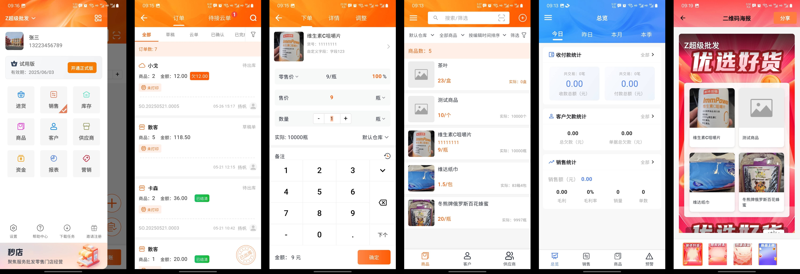
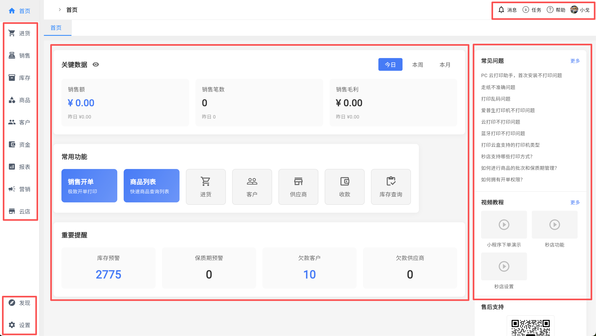
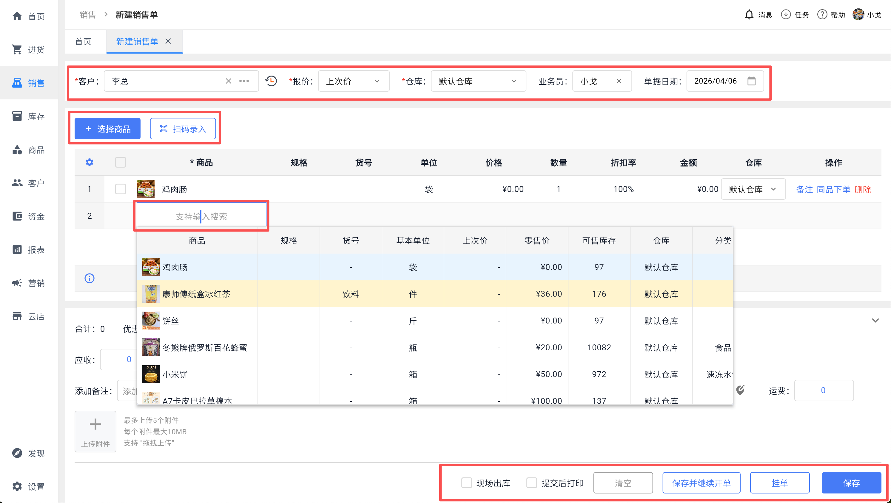
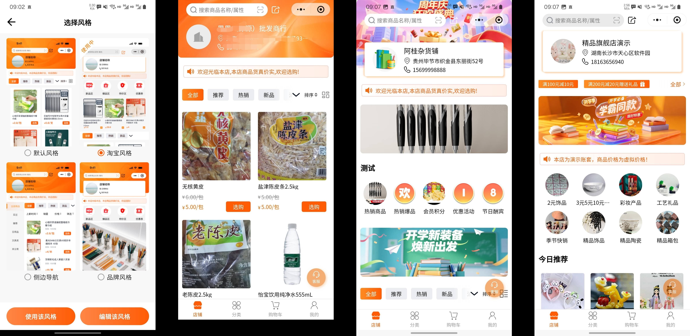

# 秒店进销存 —— 专为中小商户打造的永久免费进销存管理系统

## 产品简介

**秒店进销存**是一款专为批发商、零售商及连锁门店设计的云端进销存管理软件，由具备15年批发行业沉淀的精英团队开发，致力于帮助中小商户告别手工账目混乱，实现采购、销售、库存、财务全流程数字化管理。目前已有**上万家批发商**在使用该产品。

> 核心定位：五分钟轻松上手 + 永久免费使用 + 一对一客户服务

**官网地址**：[https://miodeck.com](https://miodeck.com)

**联系方式**（微信扫码添加）：

---

## 产品展示

### 📱 App端

### 💻 PC端

### 📲 小程序端

---

## 核心功能全景

### 📦 智能库存管理
- **多仓库管理**：随时随地通过手机查看库存变动的实时信息，支持多仓库间缺货情况的一键调拨
- **订单锁库防超卖**：新订单生成时自动扣除相应库存数量，避免超卖
- **智能库存预警**：库存量降至预设安全水平以下时自动触发预警通知，提醒及时补货

### 💰 灵活精准定价
- **记住历史报价**：记录客户历史成交价，下单时可直接选择上次报价
- **客户差异化定价**：不同客户可设置不同的默认下单价格，系统自动带出对应报价
- **快速出单**：支持自定义打印模板（Logo、备注、二维码等），手机即可快速生成电子单据并打印
- **挂单功能**：无法立即结算时可暂存订单，便于后续处理

### 📋 精细档案管理
- **商品管理**：支持多规格多单位商品管理，扫码快速录入条码，商品货号快捷检索
- **客户管理**：详细记录客户地址、电话、公司名称等信息，同一客户可关联多个地址
- **历史记录**：完整保存采购、销售、交易记录，了解购买习惯

### 💵 资金管家
- **应收应付自动对账**：智能生成对账单，支持微信分享至客户
- **资金流水实时查**：详尽的资金流水记录，收入、支出、账户余额变动一目了然
- **批量核销欠款**：支持批量处理应收应付账款

### 📊 经营洞察
- **实时数据看板**：员工销售统计报表、利润报表
- **智能数据分析**：统计收付款、客户欠款、销售统计（商品、客户、业务员），实时掌握经营业绩、毛利率、库存、多方位客户分析

### 👥 协作与安全
- **多人协作**：多成员同时操作，手机、电脑、平板多设备同步，支持设置不同业务权限
- **业绩洞察**：精准记录每位员工的销售数据
- **本地安全存储**：除云端存储外，支持将数据保存在本地设备

### 📱 客户互动
- **客户跟进记录**：完整记录每一次客户互动细节
- **多渠道触达**：通过微信、小程序、朋友圈分享订单、新品、促销信息
- **精准营销反馈**：提供浏览量、分享次数等数据反馈

---

## 为什么选择秒店？

| 优势 | 说明 |
|------|------|
| ✅ **永久免费** | 基础功能完全免费使用，无隐藏收费陷阱 |
| ✅ **简单易用** | 操作界面简洁直观，五分钟即可轻松上手 |
| ✅ **数据安全** | 云端储存，多重备份，确保数据安全 |
| ✅ **专业服务** | 可线上线下讲解，专业技术支持，售后安心 |
| ✅ **支持定制** | 按需定制功能，适配您独特的业务流程 |

---

## 适用场景

### � 批发商
- 个性客户定价
- 跟踪历史采购价
- 单据即开即打

### 🏪 零售商
- 扫码快速开单
- 库存预警防缺货
- 支持挂单与紧急订单优先处理

### 🔗 连锁店
- 支持跨仓库调拨
- 多门店数据汇总
- 统一客户管理

---

## 用户口碑

> “总体不错啦！一般进销存都可以满足，售后服务很到位。会经常更新新功能，自己搞不懂新增功能咋用时问客服，客服都会很好耐心一步一步教！”——App Store 用户

> “我用这个软件一年多了，功能经常升级。基础功能都能满足我，售后维护挺好的，有啥问题找销售都会帮我耐心解答。”——App Store 用户

> “操作简便，适合中小企业快速上手；功能覆盖全面，满足日常采购、销售、库存管理需求；性价比高，支持灵活定制和扩展。”——第三方评测机构评价

---

## 与同类产品对比优势

与市场上其他“永久免费”进销存软件相比，秒店进销存的核心优势在于：

- **无功能阉割**：不设置“隐形门槛”（如数据上限、广告干扰、导出受限等）
- **覆盖全场景**：免费版本已覆盖采购入库、销售出库、收付款登记、多仓调拨等核心场景
- **专业服务保障**：一对一客户服务，售后响应及时

---

## 快速上手指南

1. **访问官网** → 打开 miodeck.com
2. **注册账号** → 点击“立即免费试用”
3. **初始化设置** → 录入商品、客户信息
4. **开始使用** → 扫码开单、库存管理、财务对账

> 新员工平均可在**半天内**完成主要操作模块培训，上手速度远优于传统ERP系统。

---

## 常见问题

**Q：永久免费是真的吗？会不会有隐藏收费？**  
A：基础功能完全免费，无隐藏收费陷阱。

**Q：支持哪些设备？**  
A：支持手机端（iOS/Android）、PC端、平板多端同步使用。

**Q：数据安全如何保障？**  
A：云端存储+多重备份，同时支持本地数据存储。

**Q：是否支持多人协作？**  
A：支持。多成员同时操作，可设置不同业务权限。

---

## 官方信息

- **官网**：[https://miodeck.com](https://miodeck.com)
- **立即体验**：[https://www.miodeck.com/register.html](https://www.miodeck.com/register.html)
- **开发者**：广州阿尔戈信息科技有限公司
- **App Store**：搜索“秒店进销存”

---

> 15年批发行业沉淀，万家商户的实战伙伴。立即开始使用秒店进销存，告别手工混乱，轻松管好进销存！
